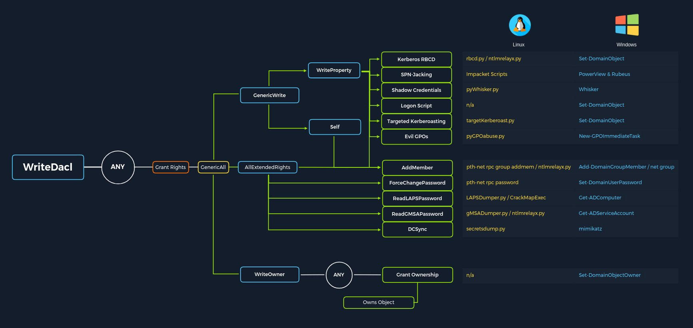

# NOTE template — hands-on section (has commands)

---

## ID
532

## Module
Active Directory Enumeration & Attacks

## Kind
notes

## Title
Section 19 — Access Control List (ACL) Abuse Primer

## Description
Introduces ACLs, DACLs, SACLs, and ACE types in Active Directory, covering how misconfigured permissions (GenericAll, GenericWrite, ForceChangePassword, WriteDACL, WriteOwner) can be abused for lateral movement, privilege escalation, and persistence.

## Tags
acl, dacl, ace, genericall, genericwrite, privilege-escalation

## Commands
- Set-DomainUserPassword (ForceChangePassword)
- Add-DomainGroupMember (AddSelf / GenericAll over group)
- Set-DomainObject (GenericWrite — set SPN for targeted Kerberoasting)
- Set-DomainObjectOwner (WriteOwner)
- Add-DomainObjectACL (WriteDACL)
- Get-DomainUser <USER> | Get-DomainSPNTicket -Format Hashcat (after setting SPN)

## What This Section Covers
Access Control Lists (ACLs) govern who can access what in AD and at what level. Misconfigurations in ACL entries (ACEs) are invisible to vulnerability scanners, often persist for years, and provide powerful attack paths for lateral movement, privilege escalation, and persistence. This section introduces the theory behind DACL/SACL/ACE structures and maps out which ACE types enable which attacks.

## Methodology
1. Understand the ACL hierarchy: **ACL** contains **ACEs**, each ACE maps a security principal to specific rights over an object.
2. Two types of ACLs: **DACL** (who is granted/denied access) and **SACL** (audit logging of access attempts).
3. Three ACE types: **Access denied** (explicit deny), **Access allowed** (explicit allow), **System audit** (logging).
4. Each ACE has four components: SID of the principal, ACE type flag, inheritance flags, and a 32-bit access mask defining the rights.
5. DACLs are evaluated top-to-bottom, stopping at the first explicit deny.
6. Enumerate abusable ACEs using BloodHound or PowerView, then exploit with the appropriate tool per the flowchart below.

## ACL Abuse Flowchart

## Key ACE Attacks Reference

| ACE | What It Enables | Abuse Tool (Windows) | Abuse Tool (Linux) |
|-----|-----------------|---------------------|-------------------|
| **ForceChangePassword** | Reset a user's password without knowing it | `Set-DomainUserPassword` | `pth-net rpc password` |
| **GenericWrite** | Write any non-protected attribute (set SPN → targeted Kerberoasting, set logon script) | `Set-DomainObject` | `targetKerberoast.py` |
| **AddSelf** | Add yourself to a security group | `Add-DomainGroupMember` | `pth-net rpc group addmem` |
| **GenericAll** | Full control — password reset, group membership, targeted Kerberoasting, read LAPS | `Set-DomainUserPassword` / `Add-DomainGroupMember` | various |
| **WriteDACL** | Modify the DACL itself — grant yourself any rights | `Add-DomainObjectACL` | n/a |
| **WriteOwner** | Take ownership of an object → then modify its DACL | `Set-DomainObjectOwner` | n/a |
| **AllExtendedRights** | ForceChangePassword + AddMember + ReadLAPSPassword + ReadGMSAPassword + DCSync | various | various |

## Lab — Questions & Answers
| Q | Answer | Found In / Method |
|---|--------|-------------------|
| Q1: What type of ACL defines which security principals are granted or denied access to an object? | `DACL` | "Discretionary Access Control List (DACL) - defines which security principals are granted or denied access to an object" |
| Q2: Which ACE entry can be leveraged to perform a targeted Kerberoasting attack? | `GenericAll` | Module text: "GenericAll... perform a targeted Kerberoasting attack" (GenericWrite also enables it by setting an SPN) |

## Key Takeaways
- ACL misconfigurations are invisible to vulnerability scanners and often go unchecked for years — they're a gold mine when "low hanging fruit" is patched.
- A DACL with no ACEs denies all access; an object with NO DACL grants full access to everyone. Opposite behaviors.
- DACLs evaluate top-to-bottom and stop at the first explicit deny — deny ACEs always win.
- **GenericAll** and **GenericWrite** over a user object enable targeted Kerberoasting: set an SPN on the user, then request and crack their TGS ticket.
- **WriteDACL** is the most dangerous single ACE — it lets you grant yourself GenericAll, which cascades into every other attack.
- ACL attacks are "destructive" (password changes, group modifications) — always get client approval and document/revert all changes.
- BloodHound is the primary tool for visualizing ACL attack paths; PowerView is the primary tool for exploiting them.

<!-- AUTO-LINKS-START -->
---
**Module:** [[00-overview|ad-enum-attacks]]  
← [[18-kerberoasting-windows]] | [[20-acl-enumeration]] →
<!-- AUTO-LINKS-END -->
